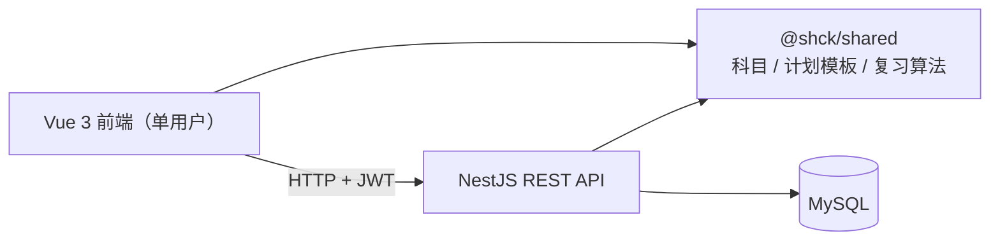

# 产品方向：个人 70 天备考计划（成人本科 · 理工类 · 2026）

> 一句话：**给自己用的轻量备考工具**——围绕 2026 年成人高考专升本（理工类）考试，
> 在 70 天里制定、跟进一份**自己的学习计划**。
>
> 状态：**当前方向**（本文件为唯一目标方向；01–05 均为历史记录，仅作参考）

---

## 一、为什么之前"做偏了"

| 阶段 | 之前的方向 | 问题 |
| --- | --- | --- |
| 旧 MVP | 上海成考 70 天通用刷题系统：题库、模考、演示账号 | 面向"大众考生"，功能过重；演示数据非真题；不是"自己用" |
| 新愿景 | 知识库 / AI / 单词 / 统计 五大模块 | 范围过大，超出真实需求，开发与维护成本高 |

**真实需求只有一句话：** 用 70 天，为 2026 年理工类考试，制定并跟进一份自己的学习计划。

---

## 二、核心原则

- **自己用** — 以个人使用为主，**保留现有注册 / 登录**（已有功能），不做多角色 / 分享
- **计划是核心** — 倒计时 + 每日任务 + 打卡 + 进度，其余都是辅助
- **计划是"我的"** — 基于个人科目权重、薄弱点、可用时间生成，而不是固定模板
- **轻量闭环** — 计划 → 打卡 → 看进度 → 调整；不追求大而全

---

## 三、2026 理工类考试科目

成人高考专升本·理工类统考科目（以当年报考公告为准）：

| 科目 | 说明 |
| --- | --- |
| 政治 | 选择题 + 简答 / 论述 |
| 英语 | 词汇语法 + 阅读 + 写作 |
| 高等数学（一） | 理工类数学 |

- **默认考试日期：2026-10-24**（可配置，与代码默认值一致）
- **计划生成**：从考试日**倒推 70 天**，即约 2026-08-16 开始，逐日拆解三科任务
- 科目可在配置中自定义增删

---

## 四、功能范围

### Keep — 本轮核心

| 功能 | 说明 |
| --- | --- |
| 考试日期配置 | 设置目标考试日，全局 70 天倒计时 |
| 个性化计划生成 | 按科目权重 / 薄弱点 / 剩余天数生成每日任务（学习 / 复习 / 练习） |
| 每日任务与打卡 | 每天每科 1 条任务，可打卡、可顺延 |
| 进度看板 | 剩余天数、今日任务、完成率、科目进度 |
| 账户与鉴权 | 保留现有注册 / 登录 / JWT（已有功能） |

### Cut — 本轮不做

| 功能 | 原因 |
| --- | --- |
| 题库 / 真题检索 / 模考闭环 | 演示数据非真题，价值低；与"个人计划"无关 |
| AI 讲解 / 错因分析 | 非核心，成本高 |
| 知识库导入 / 全文检索 | 超出 70 天备考的真实需求 |

### Later — 可选辅助（计划跑通后再加）

- 错题记录 + 间隔复习（L0–L4）
- 单词背诵 + 间隔复习
- 基础统计（学习时长、周报）

---

## 五、架构建议（沿用现有 Monorepo，大幅简化）

沿用：pnpm workspace + `@shck/shared` / `@shck/server`（NestJS）/ `@shck/web`（Vue 3）

数据层以 `study_plan` / `daily_tasks` / `user_settings` 为核心；错题、单词、统计表后置。

---

## 六、实施路线

### Phase 0 — 简化收敛（0.5–1 周）
- [ ] 保留现有注册 / 登录（已有功能，不动鉴权）
- [ ] 清理旧题库 / 模考模块依赖（旧表已被新迁移删除，需同步 seed 与模块注册）
- [ ] 确定三科科目配置（政治 / 英语 / 高数一）

### Phase 1 — 计划核心（1–2 周）
- [ ] 考试日期 + 70 天倒计时
- [ ] 个性化计划生成（科目权重 / 薄弱点 / 可用时间）
- [ ] 每日任务 + 打卡 + 顺延
- [ ] 进度看板（剩余天数 / 今日任务 / 完成率）

### Phase 2 — 辅助闭环（可选，1–2 周）
- [ ] 错题记录 + 间隔复习
- [ ] 单词 + 间隔复习
- [ ] 简单统计（时长 / 周报）

---

## 七、待确认（不阻塞开发）

1. **科目**：政治 / 英语 / 高数（一）是否正确？有无其他科目（如专业课）？
2. **考试日期**：2026-10-24 是否正确？计划起始约 2026-08-16。
3. **范围收敛**：是否同意上面的 Cut 清单？题库 / 模考 / AI 本轮确认不做？
