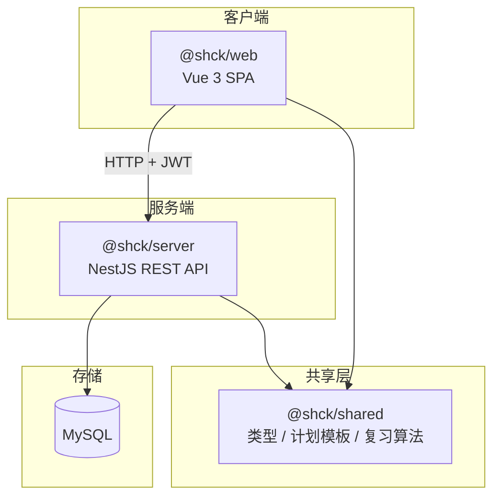

# 技术架构

## 整体架构



## Monorepo 组织

采用 **pnpm workspace** 单仓库多包管理：

```
packages/
├── shared/     # 无运行时依赖，tsup 打包 CJS + ESM
├── server/     # 依赖 shared，NestJS 编译到 dist/
└── web/        # 依赖 shared，Vite 构建静态资源
```

根 `package.json` 通过 `--filter` 编排跨包脚本：

- `pnpm dev` — 并行启动 server + web
- `pnpm build` — 先 build shared，再 build server 和 web
- `pnpm db:migrate` / `pnpm db:seed` — 先 build shared，再执行 server 侧数据库操作

## 后端分层（NestJS）

```
packages/server/src/
├── main.ts                 # 入口：全局前缀 api/v1、CORS、ValidationPipe
├── app.module.ts           # 根模块：Config + TypeORM + 业务模块
├── auth/                   # 鉴权模块
├── tasks/                  # 70 天计划
├── questions/              # 题库检索与试卷
├── exams/                  # 模考提交与批改
├── mistakes/               # 错题复习队列
├── entities/               # TypeORM 实体
├── common/                 # 统一响应格式
└── database/
    ├── data-source.ts      # TypeORM CLI 数据源
    ├── migrations/         # 数据库迁移
    └── seed.ts             # 种子数据
```

每个业务模块遵循 NestJS 标准结构：`Module → Controller → Service → Entity`。

## 前端分层（Vue 3）

```
packages/web/src/
├── main.ts                 # 应用入口
├── App.vue
├── router/index.ts         # 路由 + JWT 守卫
├── layouts/
│   └── DefaultLayout.vue   # PC 侧栏 + Mobile 底栏
├── views/                  # 页面层
│   ├── DashboardView.vue   # 今日任务 / 进度看板
│   ├── QuestionSearchView.vue
│   ├── MockExamView.vue
│   ├── MistakesView.vue
│   └── LoginView.vue
├── components/             # 业务组件
│   ├── task/TaskGroup.vue
│   └── common/KatexRenderer.vue
├── stores/                 # Pinia 状态
│   ├── useUserStore.ts
│   └── useTaskStore.ts
└── api/                    # Axios 封装
    ├── client.ts           # 拦截器 + unwrap
    ├── auth.ts
    ├── task.ts
    ├── question.ts
    ├── exam.ts
    └── mistake.ts
```

## 核心数据流

### 1. 用户注册与计划初始化

```
注册/登录 → JWT 存入 localStorage
    ↓
POST /tasks/init-plan（传入 exam_date）
    ↓
Server 倒推 69 天 → 按 phaseTemplates 生成 210 条 daily_tasks
    ↓
Dashboard 展示 current_day 任务 + 全局进度
```

### 2. 模考与错题闭环

```
GET /questions/papers → 选卷
    ↓
GET /questions/papers/:id → 加载题目
    ↓
前端倒计时 + localStorage 缓存答案
    ↓
POST /exams/:paperId/submit → 客观题自动批改
    ↓
错题 → MistakesService.upsertMistake → user_mistakes 表
    ↓
GET /mistakes/review-queue → 到期复习
    ↓
PATCH /mistakes/:id/review → 更新掌握度 + 下次复习时间
```

### 3. 错题复习间隔算法

掌握度 L0–L4，答对后递增，间隔为 **1 / 2 / 4 / 7 天**（L4 后视为已掌握，间隔设为 10 年）：

```typescript
// packages/shared/src/index.ts
export function reviewIntervalDays(masteryLevel: number): number | null {
  const intervals = [1, 2, 4, 7];
  return intervals[masteryLevel] ?? null;
}
```

## 鉴权机制

- 注册/登录返回 JWT，前端存入 `localStorage.shck_token`
- Axios 请求拦截器自动附加 `Authorization: Bearer <token>`
- 后端 `@UseGuards(JwtAuthGuard)` 保护除 auth 外的所有接口
- Vue Router `beforeEach` 守卫：无 token 跳转 `/login`

## 统一 API 响应格式

```typescript
interface ApiResponse<T> {
  code: number;    // 0 表示成功
  message: string;
  data: T;
}
```

定义在 `@shck/shared`，前后端共用。

## 部署架构

Docker Compose 启动两个服务：

| 服务 | 端口 | 说明 |
| --- | --- | --- |
| `api` | 3000 | NestJS 容器 |
| `web` | 8080 | Nginx 托管 Vue 静态资源，反向代理 API |

本地开发时 web 运行在 Vite dev server（5173），直接请求 localhost:3000 API。
