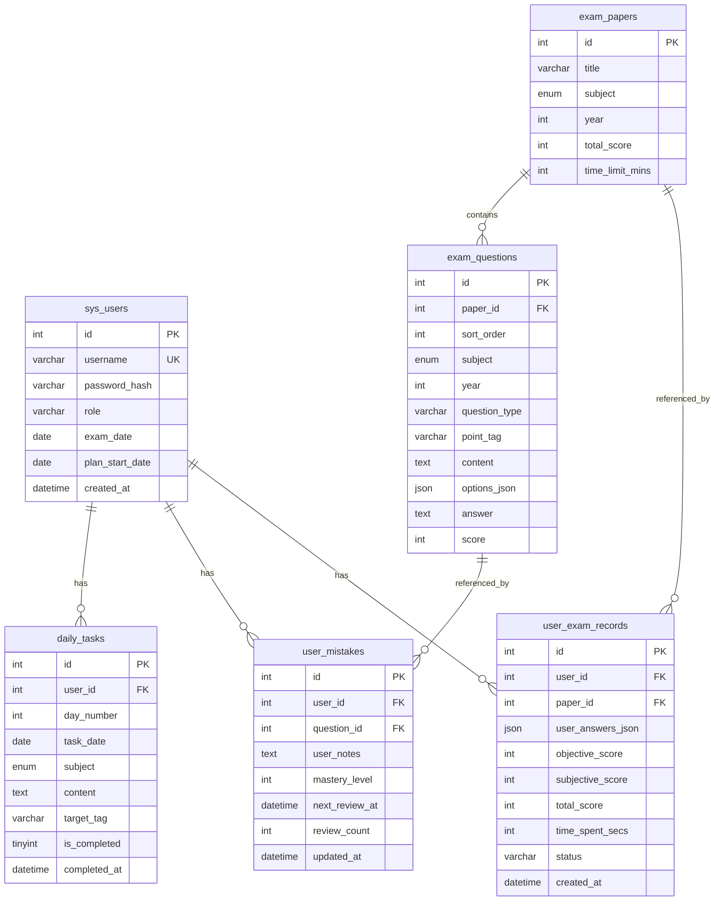

# 数据库设计

## 概览

- **引擎：** MySQL InnoDB
- **字符集：** utf8mb4
- **ORM：** TypeORM（`synchronize: false`，仅通过 migration 变更）
- **默认库名：** `sys`（可通过 `.env` 的 `DB_DATABASE` 配置）

TypeORM 另维护 `migrations` 表记录已执行的迁移。

## ER 关系



## 表结构详情

### sys_users — 用户

| 字段 | 类型 | 说明 |
| --- | --- | --- |
| id | INT AUTO_INCREMENT | 主键 |
| username | VARCHAR(50) UNIQUE | 用户名 |
| password_hash | VARCHAR(255) | bcrypt 哈希 |
| role | VARCHAR(20) | 默认 `USER` |
| exam_date | DATE | 考试日期，默认 `2026-10-24` |
| plan_start_date | DATE NULL | 计划起始日（init-plan 后写入） |
| created_at | DATETIME | 创建时间 |

**实体文件：** `entities/user.entity.ts`

---

### exam_papers — 试卷

| 字段 | 类型 | 说明 |
| --- | --- | --- |
| id | INT AUTO_INCREMENT | 主键 |
| title | VARCHAR(100) | 试卷标题 |
| subject | ENUM | POLITICS / ENGLISH / MATH |
| year | INT | 年份 |
| total_score | INT | 满分，默认 150 |
| time_limit_mins | INT | 时限（分钟），默认 150 |

**唯一约束：** `(subject, year)` — 每科每年仅一套卷

**实体文件：** `entities/exam-paper.entity.ts`

---

### exam_questions — 题目

| 字段 | 类型 | 说明 |
| --- | --- | --- |
| id | INT AUTO_INCREMENT | 主键 |
| paper_id | INT FK NULL | 所属试卷 |
| sort_order | INT | 卷内排序 |
| subject | ENUM | 科目 |
| year | INT | 年份 |
| question_type | VARCHAR(20) | SINGLE / SHORT_ANSWER / BIG_QUESTION |
| point_tag | VARCHAR(50) | 考点标签 |
| content | TEXT | 题干（可含 LaTeX） |
| options_json | JSON NULL | 选择题选项 `[{ key, text }]` |
| answer | TEXT | 参考答案 |
| score | INT | 分值，默认 5 |

**索引：**

- `idx_subject_tag (subject, point_tag)` — 科目+标签筛选
- `idx_paper_id (paper_id)` — 按卷查题
- `ft_search (content, point_tag)` — 全文索引

**实体文件：** `entities/exam-question.entity.ts`

---

### daily_tasks — 每日任务

| 字段 | 类型 | 说明 |
| --- | --- | --- |
| id | INT AUTO_INCREMENT | 主键 |
| user_id | INT FK | 用户 |
| day_number | INT | 第几天（1–70） |
| task_date | DATE | 对应日期 |
| subject | ENUM | 科目 |
| content | TEXT | 任务描述 |
| target_tag | VARCHAR(50) NULL | 关联考点标签 |
| is_completed | TINYINT(1) | 是否完成 |
| completed_at | DATETIME NULL | 完成时间 |

**唯一约束：** `(user_id, day_number, subject)` — 幂等，每用户每天每科仅一条

**实体文件：** `entities/daily-task.entity.ts`

---

### user_mistakes — 错题

| 字段 | 类型 | 说明 |
| --- | --- | --- |
| id | INT AUTO_INCREMENT | 主键 |
| user_id | INT FK | 用户 |
| question_id | INT FK | 题目 |
| user_notes | TEXT NULL | 用户笔记 |
| mastery_level | INT | 掌握度 0–4 |
| next_review_at | DATETIME | 下次复习时间 |
| review_count | INT | 复习次数 |
| updated_at | DATETIME | 更新时间 |

**唯一约束：** `(user_id, question_id)` — 每用户每题仅一条记录

**索引：** `idx_review_queue (user_id, next_review_at, mastery_level)` — 复习队列查询

**实体文件：** `entities/user-mistake.entity.ts`

---

### user_exam_records — 考试记录

| 字段 | 类型 | 说明 |
| --- | --- | --- |
| id | INT AUTO_INCREMENT | 主键 |
| user_id | INT FK | 用户 |
| paper_id | INT FK | 试卷 |
| user_answers_json | JSON | 用户答案 |
| objective_score | INT | 客观题得分 |
| subjective_score | INT | 主观题自评分 |
| total_score | INT | 总分 |
| time_spent_secs | INT | 用时（秒） |
| status | VARCHAR(20) | 默认 `COMPLETED` |
| created_at | DATETIME | 提交时间 |

**索引：** `idx_exam_records_user (user_id, created_at)`

**实体文件：** `entities/user-exam-record.entity.ts`

---

## 迁移与种子

### 运行迁移

```bash
pnpm db:migrate
```

迁移文件：`packages/server/src/database/migrations/2026080301-initial-schema.ts`

### 运行种子

```bash
pnpm db:seed
```

种子脚本 `packages/server/src/database/seed.ts` 写入：

- 体验用户 `demo`（密码 `Study70Days!`）
- 2019–2025 年 × 3 科 = **21 套练习卷**
- 每卷 2 道示例题 = **42 道题目**

种子逻辑为幂等：已存在的用户/试卷/题目不会重复创建。
